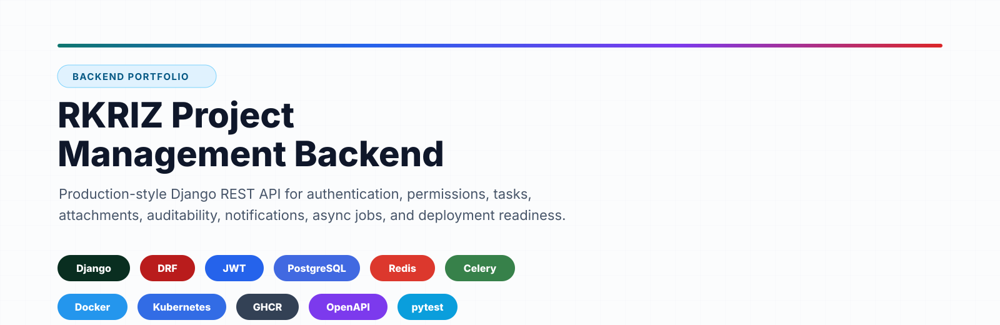
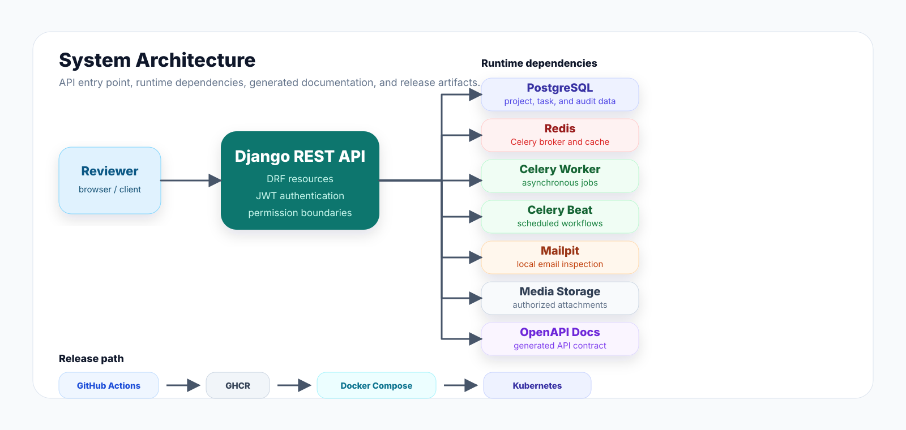

<p align="center">
  
</p>

# RKRIZ Project Management Backend

Production-style Django/DRF project management API built to demonstrate backend
engineering across authentication, authorization, async processing, auditability,
deployment, reviewer-facing documentation, and release operations.

<p>
  
  
  
  
  
  
  
  
  
</p>

## Reviewer Path

| Goal | Start here |
| --- | --- |
| See the public entry point | `http://localhost:8000/` |
| Understand the system shape | [Architecture](docs/architecture.md) |
| Inspect the live API contract | `http://localhost:8000/api/v1/docs/` |
| Run the stack locally | [Local Development](#local-development) |
| Review quality strategy | [Testing Strategy](docs/testing/strategy.md) |
| Check release readiness | [Docker](docs/deployment/docker.md), [Kubernetes](docs/deployment/kubernetes.md) |
| Review security posture | [Security](docs/security.md) |
| Inspect production monitoring | `https://grafana.radekkriz.space` |

## What This Demonstrates

- JWT authentication and user management for an API-first backend.
- Project memberships and role-based access boundaries.
- Project, task, comment, attachment, audit log, and notification workflows.
- File upload quotas and attachment handling.
- Celery worker and beat scheduling backed by Redis.
- PostgreSQL persistence with Django migrations.
- OpenAPI documentation generated from the API surface.
- Reviewer-facing homepage that routes to API docs and MkDocs.
- Docker Compose local development and published image release flow.
- Single-port release gateway for homepage, API docs, MkDocs, and admin.
- Prometheus and Grafana monitoring with Cloudflare Access protected dashboards.
- Kubernetes deployment artifacts for API, worker, beat, migrations, ingress, and storage.
- Unit, integration, and end-to-end testing strategy.

This is an API-centered backend project. The public homepage is a reviewer entry
point; it is not intended to be a full product frontend.

## Architecture

<p align="center">
  
</p>

After the stack starts, the generated OpenAPI documentation is available at:

```text
http://localhost:8000/api/v1/docs/
```

## Local Development

Run the API, PostgreSQL, Redis, Celery, Mailpit, and documentation containers:

```bash
docker compose up --build
```

Then open:

```text
Home: http://localhost:8000/
UI: http://localhost:5174/
API: http://localhost:8000/api/v1/
OpenAPI: http://localhost:8000/api/v1/docs/
Mailpit: http://localhost:8025
Docs: http://localhost:8001
```

The homepage uses `/ui/` as its frontend link and `/docs/` as its documentation
link. In local development Django redirects those paths to the Vite and MkDocs
services; in release Nginx serves the built UI and MkDocs directly on the same
public port.

Run migrations and tests:

```bash
docker compose run --rm api python manage.py migrate
docker compose run --rm api pytest -m "unit or integration" -q
```

Create a deterministic demo dataset:

```bash
docker compose run --rm api python manage.py seed_demo_data
```

The seed command creates or updates this predefined superuser:

```text
email: demo.admin@example.com
password: DemoAdmin123!
display name: Demo Admin
```

It also creates demo users, projects, memberships, tasks, comments, text
attachments, and notifications. Override the credentials with
`DEMO_SUPERUSER_EMAIL`, `DEMO_SUPERUSER_PASSWORD`,
`DEMO_SUPERUSER_DISPLAY_NAME`, and `DEMO_USER_PASSWORD`.

## Documentation

Run only the MkDocs documentation site:

```bash
docker compose up docs
```

Then open:

```text
http://localhost:8001
```

Key documentation:

- [API Overview](docs/api/overview.md)
- [API Endpoints](docs/api/endpoints.md)
- [Architecture](docs/architecture.md)
- [Security](docs/security.md)
- [Testing Strategy](docs/testing/strategy.md)
- [Observability](docs/operations/observability.md)

## Release Images

GitHub Actions builds multi-arch runtime images and publishes them to GHCR on
pushes to `master`, `main`, and `v*` tags:

```text
ghcr.io/<owner>/<repo>/api:latest
ghcr.io/<owner>/<repo>/api:sha-<commit>
ghcr.io/<owner>/<repo>/api:<tag>
ghcr.io/<owner>/<repo>/web:latest
ghcr.io/<owner>/<repo>/web:sha-<commit>
ghcr.io/<owner>/<repo>/web:<tag>
```

The `web` image is the public entry point in release and exposes the homepage,
API docs, MkDocs, and admin through one host port.

Monitoring is optional and runs from `docker-compose.release.monitoring.yml`.
Grafana is intended to be published as `https://grafana.radekkriz.space` behind
Cloudflare Access while Prometheus and `/internal/metrics/` stay private.

## Release And Deployment

The repository includes release-oriented Docker and Kubernetes artifacts:

- GHCR publishing for the API and web runtime images.
- Release Compose file for running published images.
- `.env_template` for release Compose configuration.
- `seed-demo` release Compose tool service for optional demo data.
- Optional storage quota override for Linux hosts that support writable-layer quotas.
- Kubernetes manifests for API, Celery worker, Celery beat, migrations, service,
  ingress, and media storage.
- Optional Cloudflare Tunnel deployment example for clusters without a public IP.
- Optional Prometheus, Grafana, and exporter overlay for production observability.

See:

- [Docker Deployment](docs/deployment/docker.md)
- [Kubernetes Deployment](docs/deployment/kubernetes.md)
- [Cloudflare Tunnel](docs/deployment/cloudflare-tunnel.md)
- [Release Strategy](docs/development/release-strategy.md)

## Git Policy

Normal merge requests target `release`. `master` contains released code and should
accept only merge requests from `release` or `hotfix/*`.

Enable local commit title validation:

```bash
git config core.hooksPath .githooks
```
