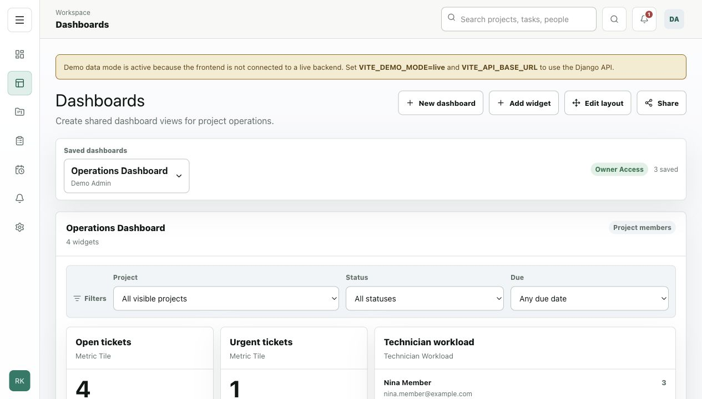
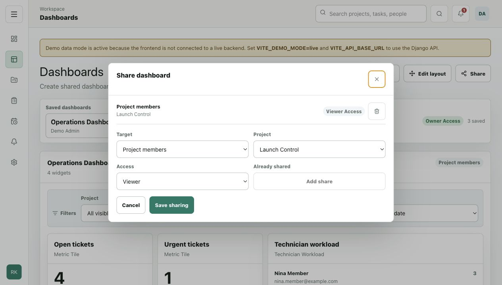
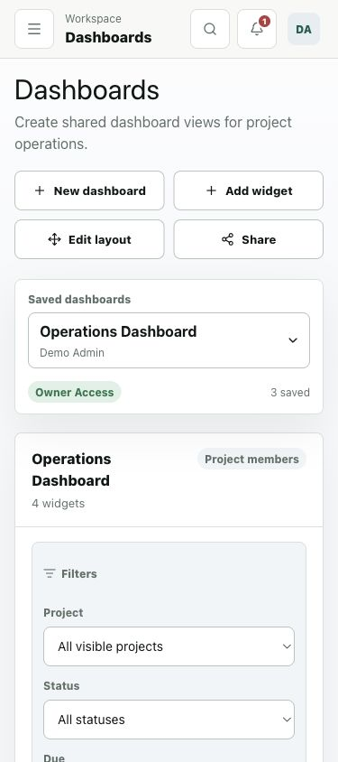
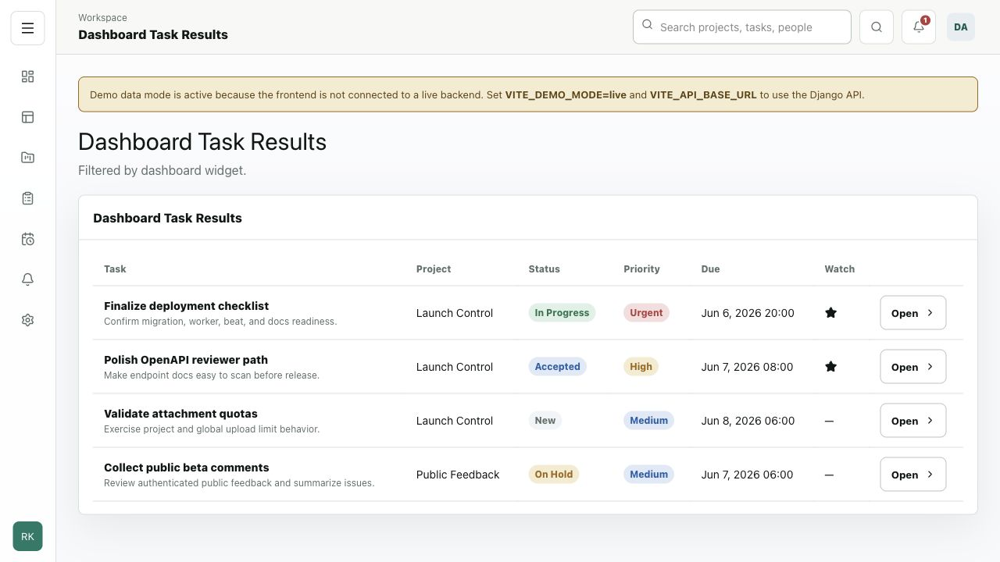

# PROJECT-027 Dashboard MR Walkthrough

This page documents the working UI states for PR #18,
`project-027-configurable-dashboards`. The screenshots were captured against the
local dashboard UI in demo data mode so reviewers can inspect the feature from
the MkDocs site and directly in the GitHub diff.

## Review Scope

- Top-level Dashboards navigation item opens the dashboard workspace.
- Saved dashboards sit above the widget area with owner access and saved count
  state visible.
- Primary actions stay on one row on desktop: new dashboard, add widget, edit
  layout, and share.
- Dashboard widgets render inside the bounded responsive grid without overlap.
- Temporary filters are available at dashboard level.
- Owners can manage sharing through dynamic project-member targets or specific
  users.
- Drilldown from dashboard task data opens the task list view with the dashboard
  filter context preserved.

## Local Verification Flow

1. Start the local UI.
2. Open `/ui/dashboards`.
3. Review the seeded dashboards from `seed_demo_data`.
4. Open the share dialog from the active dashboard.
5. Resize to a mobile viewport and verify the actions and saved dashboard
   selector remain usable.
6. Drill into dashboard task data and confirm the task list route opens.

## Screenshots

### Desktop Dashboard

### Share Dialog

### Mobile Dashboard

### Drilldown

